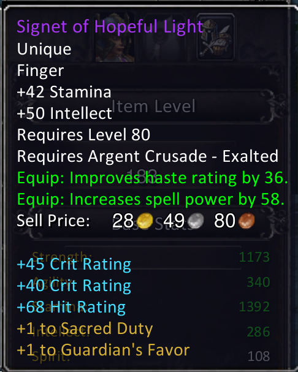
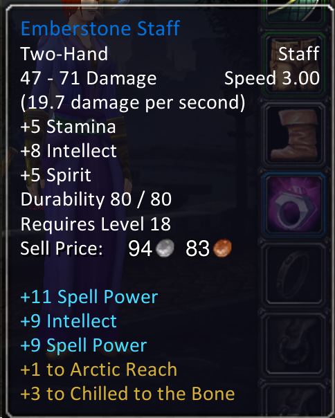
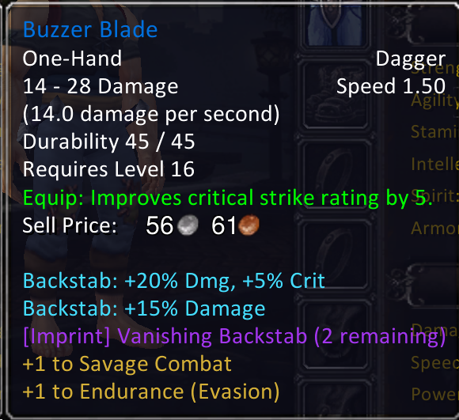

# mod-item-affixes

ARPG-style random affix system for AzerothCore (WoTLK 3.3.5a). Items receive affix slots when
they enter a player's inventory. Affixes are chosen by the player through an in-game Roll Menu
and persist as `SpellModifier` objects (or generic stat bonuses) that survive bank, mail, and
trade.

---

## What it looks like

Every item — from a level 16 dagger to a level 80 epic ring — gets its own set of affixes chosen by the player.

| Level 80 Ret Paladin — ring | Level 18 Mage — staff | Level 16 Rogue — dagger |
|---|---|---|
|  |  |  |
| Stat affixes (+Crit, +Hit) and two talent bonuses to Sacred Duty and Guardian's Favor. | Spell Power stacking and talent ranks in Arctic Reach and Chilled to the Bone — at level 18. | Class skill modifiers on Backstab, plus an Imprint (Vanishing Backstab) showing 2 Return Allowances. |

Affixes scale with item level, so they feel meaningful at every stage of the game without overshadowing base item stats.

---

## How It Works

1. **Acquisition** — when an item enters a player's bags (loot, quest reward, purchase, craft),
   the module assigns 1–3 unrolled affix slots based on item quality and records them in
   `item_affix` (characters DB). Nothing is rolled yet; the item has no class fingerprint at
   this point and can be freely traded.

2. **Roll Menu** — when the player Alt+Clicks an item that has unrolled slots, a preference page
   appears. The player can steer the roll before committing:
   - **What to roll?** — Any / Stats / Class Skills
   - **Talent Tree:** — which spec's passive talent bonus can roll (Any or a specific spec); also doubles the chance of rolling class affixes for that tree
   - **Stat family?** — Any / Tank / Physical / Caster / Healer / Ranged *(hidden when Class Skills selected)*
   - **Main stat?** — Any / Strength / Agility / Intellect / Spirit *(hidden when Class Skills selected)*

3. **Rolling** — clicking "Roll Affix" sends preferences to the server. The server presents
   1–4 affix options depending on item quality (configurable). The player picks one option to
   apply; the rest are discarded.

4. **Reroll System** — after the initial roll, blue and epic items receive a number of rerolls
   (configurable per quality). In the option picker the player can:
   - **Lock** any option with the `[ ]` button beside it — locked options are preserved across rerolls
   - **Reroll** all unlocked options while keeping locked ones using the "Reroll (N)" button
   - Lock the option they want, freely change the roll preferences (type/spec/stat family/main stat), and reroll until satisfied or rerolls run out
   - Pick any visible option at any time to finalise that slot

5. **Talent affix** — each slot roll also attempts to roll a passive talent bonus (10% chance on
   green items, 50% on blue/epic). The talent affix is applied when the player commits to an
   option pick — not at roll time. Talent affixes stack per slot, so a fully-rolled epic can
   hold up to 3 talent affixes. The Talent Tree preference controls which spec tree the talent
   draws from.

6. **Equip** — `SpellModifier` objects and stat bonuses are applied to the player via
   `Player::AddSpellMod` / `ApplyGenericStat`.

7. **Unequip** — all mods are removed and freed.

8. **Login** — mods are reapplied for all currently equipped affixed items.

---

## Affix Slots by Quality

| Quality       | Regular affix slots | Options per roll | Rerolls | Talent chance per slot |
|---------------|---------------------|------------------|---------|------------------------|
| Grey (poor)   | 0 — skipped         | —                | —       | —                      |
| White / Green | 1                   | 1 (configurable) | 0       | 10%                    |
| Blue (rare)   | 2                   | 3 (configurable) | 3       | 50%                    |
| Purple (epic) | 3                   | 4 (configurable) | 5       | 50%                    |

Option counts and reroll counts are all configurable — see [Server Configuration](#server-configuration).

Two-handed weapons receive 1 additional slot above the quality baseline (configurable via `TwoHanderBonusSlots`).

Green items can only roll universal stat affixes (Stamina, Crit, Haste, Hit, etc.). Role-specific
stats (Spell Power, Attack Power, Expertise, Dodge/Defense/Parry) require blue quality or higher.

---

## Stat Value System

Generic stat affix values (Strength, Stamina, Spell Power, etc.) are computed at roll-time from
the item's WotLK stat budget — no hardcoded value tables.

### Budget formula

```
baseBudget  = f(ItemLevel)          # piecewise linear by era (see below)
slotBudget  = baseBudget × slotMod  # 100% / 74% / 54% by slot type
affixBudget = slotBudget × qualityFraction × StatMultiplier
statValue   = irand( floor(affixBudget × BudgetMinRoll / cost),
                     floor(affixBudget / cost) )
```

**Era breakpoints** (using item gear score, not required level):

| Era       | iLvl range | Formula                   | Example iLvl 200 |
|-----------|-----------|---------------------------|-----------------|
| Vanilla   | 1 – 66    | `iLvl × 0.78 + 1.5`      | —               |
| TBC       | 67 – 114  | `iLvl × 1.25 − 28.5`     | —               |
| WotLK     | 115 – 284 | `iLvl × 1.92 − 105`      | 279 pts         |

**Slot multipliers:**

| Multiplier | Slots                                   |
|------------|-----------------------------------------|
| 100%       | Head, Chest, Legs, 2H Weapons, Ranged   |
| 74%        | Shoulders, Hands, Waist, Feet           |
| 54%        | Neck, Cloak, Wrists, Rings, Trinkets, 1H Weapons, Off-hands, Wands |

**Stat exchange rates** (WotLK itemization):

| Stat            | Cost per point | Effect                          |
|-----------------|---------------|---------------------------------|
| Attack Power    | 0.5           | You get 2× the budget in AP     |
| Spell Power     | 0.86          | Slightly more SP than primaries |
| Everything else | 1.0           | 1 budget point = 1 stat point   |

**Example** — iLvl 251 2H weapon, Epic (purple), `StatMultiplier = 1.0`:
- Base budget: `251 × 1.92 − 105 = 377.9`
- Slot (2H = 100%): `377.9`
- Quality fraction (purple = 10%): `37.8`
- Strength roll: `irand(28, 37)` — varies each roll within a fixed window
- Attack Power roll: `irand(56, 75)`
- Spell Power roll: `irand(32, 43)`

---

## Imprint System

Imprints are rare, class-specific enchantments that sit alongside an item's regular affixes. Only
one Imprint can ever be on an item at a time. Imprints are more powerful than stat affixes and
may trigger custom server-side effects (see `src/Imprints/` for implementations).

### Acquiring an Imprint

- **Roll Menu** — when an Imprint option appears during a roll (chance configured by
  `ItemAffixes.ImprintRollChance`), selecting it applies the Imprint to the item. The affix slot
  is **refunded** — Imprints do not consume a regular affix slot.
- **GM command** — `.imprint grant <name>` grants a Rune directly to the player's bags for
  testing. `.imprint apply` applies the Rune from the player's bags to a targeted item.

### Rune apply mechanic (in-game)

An Imprint can be re-applied to a new item using its Rune item:

1. **Right-click the Rune** in your bags — the cursor displays the Rune icon and a message
   prompts you to left-click the target item.
2. **Left-click the target item** — the Imprint is applied. If the item already has an Imprint,
   an error is shown instead.
3. **Right-click anywhere** (or click empty bag space) — cancels apply mode.

The Rune apply mode shows a full-screen click interceptor so the target item is never
accidentally picked up or equipped during the interaction.

### Return Allowances

Each Rune tracks how many times it can be re-applied after disenchanting an imprinted item
(**Return Allowances**). The count is shown in the tooltip as `(N remaining)` in purple, or
`(0 remaining — no rune on disenchant)` in red when the count is zero. Disenchanting an item
with an Imprint whose allowance is 0 does **not** grant a Rune.

The starting allowance count for newly granted Runes is configurable via `ImprintExtractionCount`.

### Disenchanting

Disenchanting an imprinted item grants a Rune into the player's bags (if allowances remain) and
removes the Imprint from the item. The returned Rune's allowance count is decremented by one.

---

## Prerequisites

- AzerothCore WoTLK 3.3.5a (standard build)
- CMake, MSVC (or GCC/Clang), MySQL 8.x
- PowerShell 5.1+ (Windows) or PowerShell Core `pwsh` (Linux/macOS, optional — only needed to regenerate SQL from JSON)
- GM account with `SEC_GAMEMASTER` access (for testing)

---

## Installation

> **Important:** Confirm your vanilla AzerothCore server works and you can create characters before starting. Do not clone this module until the vanilla server is verified — if the module is present during the initial build it will try to create tables that don't exist yet and prevent the worldserver from starting.

### Step 1 — Place the module and apply core patches

Clone the module into your AzerothCore `modules/` directory:

```
git clone https://github.com/Nevaden/mod-item-affixes modules/mod-item-affixes
```

Then apply the required engine patches (idempotent — safe to run more than once):

```
# Windows — double-click or run from the module folder:
scripts\install\0-apply-core-patches.bat

# Windows (command line / CI):
powershell -ExecutionPolicy Bypass -File scripts\apply_core_patches.ps1

# Linux / macOS:
pwsh -File scripts/apply_core_patches.ps1
```

If the script reports `[FAIL]` on any patch, see `CORE_PATCHES.md` for the exact change to apply by hand.

### Step 2 — Configure

**Windows:** Copy `scripts\config.bat.example` to `scripts\config.bat` and fill in your values.

**Linux / macOS:** Copy `scripts/config.sh.example` to `scripts/config.sh` and fill in your values.

`config.bat` / `config.sh` are gitignored — your credentials are never committed.

Run the config check to verify everything before proceeding:

```
# Windows
scripts\check-config.bat

# Linux / macOS
bash scripts/check-config.sh
```

### Step 3 — Build the worldserver with the module

Stop the worldserver, then rebuild and reinstall from your AzerothCore build directory:

```
cmake --build "path\to\build" --config RelWithDebInfo --target worldserver
cmake --install "path\to\build" --config RelWithDebInfo
```

### Step 4 — Run the install scripts

Each script does one focused thing. Run them in order:

| Script | What it does |
|--------|-------------|
| `scripts\install\1-create-schema.bat` / `.sh` | Creates mod tables in the characters DB; copies `.conf.dist` to `.conf` |
| `scripts\install\2-load-data.bat` / `.sh` | Generates SQL from JSON and applies all affix/imprint/spell data to the world DB |
| `scripts\install\3-patch-client.bat` *(Windows only)* | Patches `SpellItemEnchantment.dbc` and `Spell.dbc`; rebuilds client MPQ files |

> On first run the patch scripts auto-detect two free MPQ suffix letters (scanning `patch-Z.MPQ` downward) and record them in `scripts\local_config.bat` for reuse. To pin specific letters, set `PATCH_SUFFIX_DBC` and `PATCH_SUFFIX_SPELLS` in `config.bat`.

If the WoW client is on a separate machine, copy both new MPQ files from your Data folder to that machine after step 3.

### Step 5 — Install the client addon

Copy `addon\ItemAffixes\` to your WoW client's AddOns folder:

```
WoW Client 3.3.5a\Interface\AddOns\ItemAffixes\
```

### Step 6 — Start worldserver

Start the worldserver. Look for these lines in the console to confirm the module loaded:

```
mod-item-affixes: loaded NNN affix template(s).
mod-item-affixes: loaded NNN talent affix def(s).
mod-item-affixes: Loaded N Imprint definition(s).
```

---

## Keeping Up to Date

After `git pull`, run the appropriate update script. Schema tables are never touched.

| Need | Script |
|------|--------|
| Update everything (affixes + imprints + client patch) | `scripts\update\update-all.bat` / `.sh` |
| Affix / talent data only | `scripts\update\affixes.bat` / `.sh` |
| Imprint definitions only | `scripts\update\imprints.bat` / `.sh` |
| Client MPQ files only | `scripts\update\client-patch.bat` *(Windows only)* |

If the pull also includes C++ changes, rebuild and reinstall the worldserver first, then run the update script.

If the pull adds new core patches, re-run `scripts\apply_core_patches.ps1` — already-applied patches are skipped automatically.

---

## Uninstalling

Run the uninstall scripts in order. Each one is a separate, confirmable step.

| Script | What it does |
|--------|-------------|
| `scripts\uninstall\1-drop-tables.bat` / `.sh` | Drops `item_affix`, `item_talent_affix`, `item_imprint` from characters DB (confirmation required) |
| `scripts\uninstall\2-clean-world-data.bat` / `.sh` | Drops world tables; removes rune/spell rows from shared tables; removes server conf file; **shows which MPQ files to delete manually** |
| `scripts\uninstall\3-rebuild-server.bat` / `.sh` | Reconfigures cmake to exclude module and rebuilds worldserver |

After the scripts finish, complete these steps manually:

1. **Delete the MPQ files** shown by step 2. The script reads the suffix letters from `scripts\local_config.bat` (recorded at install time) and shows the exact file paths. Only delete files you know belong to this mod.
2. Remove the addon: `Interface\AddOns\ItemAffixes\`
3. Restart the WoW client
4. Restart the worldserver

> **All player affix data is permanently lost** when step 1 runs — `item_affix`, `item_talent_affix`, and `item_imprint` are dropped and cannot be recovered.

---

## Disable / Enable (without data loss)

Use these when you want to temporarily turn the module off without deleting player data.

| Script | What it does |
|--------|-------------|
| `scripts\manage\disable.bat` / `.sh` | Excludes module from cmake build and rebuilds (data preserved) |
| `scripts\manage\enable.bat` / `.sh` | Re-includes module in cmake build and rebuilds |

Both scripts require `CMAKE` and `BUILD_DIR` to be set in `config.bat` / `config.sh`.

Items affixed before disabling keep their `item_affix` rows; no mods are applied while the module is disabled. Re-enabling fully restores all functionality.

---

## Multiplayer Affix Visibility

### Inspecting other players

When you open another player's inspect window and hover over their equipped items, the addon
shows their affix lines in the tooltip — applied affixes in blue, talent bonuses in gold,
imprints in purple. Items not yet rolled show a grey `[Affix slot not yet rolled]` placeholder.

Shift+hovering an inspected item shows a comparison tooltip of your own equipped item in the
same slot, with your affixes included.

### Trade window

Hovering items in the trade window — both your items and the partner's — shows their affix
state. Shift+hover shows a comparison tooltip against your currently equipped item.

### Auction house

Hovering any item in the Auction House shows its affix state:

- **Applied affixes** — blue, identical to the item owner's tooltip view.
- **Talent bonuses** — gold.
- **Imprints** — purple, with Return Allowance count.
- **Unrolled slots** — `[Affix slot not yet rolled]` in grey.

AH lookups are read-only. Shift+hover shows a comparison tooltip against your equipped item.

Items that have no affixes cached yet show `[Fetching affixes...]` briefly while the server
responds; this resolves automatically without needing to re-hover.

When multiple copies of the same item are listed at the same price by the same seller, each
listing correctly shows its own unique affixes. The addon assigns a per-listing offset so the
server returns the correct physical item instance for each slot.

---

## Screenshots

### Alt+Click to open the Roll Menu


The Roll Menu appears when a player Alt+Clicks any item with unrolled affix slots.

### Roll preferences


Players steer the roll before committing — stat family, spec tree, main stat, and type (stats vs. class skills). The spec selector also boosts the chance of rolling class affixes for that tree.

### Class skills roll


When "Class Skills" is selected, the server presents spell modifier options for the player's class and the talent tree chosen in the Roll Menu. A class skill only appears as an option if the character has already learned that ability — you will never roll a modifier for a spell you don't know.

### Reroll System — initial roll with lock buttons


Each option has a lock toggle (`[ ]`) beside it. The "Reroll (N)" button shows how many rerolls remain. Pick any option at any time, or lock the ones you want to keep and reroll the rest.

### Reroll System — lock one, reroll for more class skills


Shield of Righteousness is locked (`[L]`). The other options were rerolled targeting Protection class skills. The reroll preferences (type, spec, stat family) can be changed freely between rerolls — only locked options are preserved.

### Reroll System — lock two, switch to tank stats


Two class skill options are now locked. Type was switched to "Stats" and Stat Family to "Tank" before the next reroll — giving tank stat options for the remaining unlocked slot. A stat option can be chosen here or another reroll attempted.

### Imprint option


Imprint options appear in the roll menu alongside stat and class skill choices. Selecting one applies the Imprint and refunds the affix slot. Imprints display their Return Allowance count in the tooltip so players know whether disenchanting will yield a Rune.

---

## Verifying It Works

1. Log in as a GM character.
2. Loot or purchase any green-quality or better item.
3. Alt+Click the item — the Roll Menu frame should appear.
4. Select preferences (or leave at defaults) and click "Roll Affix."
5. Choose one of the presented options, or lock options and use "Reroll (N)" to reroll.
6. Equip the item — the tooltip shows the applied affix and any talent bonus.
7. If the affix is a spellmod, cast the affected spell and confirm the modifier applies.

**Testing Imprints:**
1. `.imprint grant <name>` — grants a Rune to your bags.
2. Right-click the Rune — cursor indicator appears and apply mode activates.
3. Left-click a target item — Imprint is applied; Rune is consumed.
4. Disenchant the imprinted item — a Rune is returned (if allowances remain).

---

## Server Configuration

Edit `env/dist/configs/modules/mod_item_affixes.conf` (created from `conf/mod_item_affixes.conf.dist` by `install/1-create-schema`):

```ini
# Roll Menu UI toggles (0=off, 1=on)
ItemAffixes.EnableClassSkillAffixes = 1   # "Stats vs Class Skills" section
ItemAffixes.EnableTalentAffixes     = 1   # Talent Tree section
ItemAffixes.EnableRoleSelection     = 1   # Stat Family section
ItemAffixes.EnableMainStatSelection = 1   # Main Stat section

# Extra affix slots granted to two-handed weapons (default: 1)
ItemAffixes.TwoHanderBonusSlots = 1

# Number of options presented to the player per roll (clamped 1–6)
ItemAffixes.OptionsCountGreen  = 1   # Green (Uncommon): 1 option — no choice
ItemAffixes.OptionsCountBlue   = 3   # Blue  (Rare):     3 options
ItemAffixes.OptionsCountPurple = 4   # Purple (Epic):    4 options

# Number of rerolls granted after the initial roll
# Each reroll re-generates all unlocked options; locked options are preserved
ItemAffixes.RerollsGreen  = 0   # Green: no rerolls
ItemAffixes.RerollsBlue   = 3   # Blue:  3 rerolls
ItemAffixes.RerollsPurple = 5   # Purple: 5 rerolls

# Budget fractions — share of item budget allocated per affix roll
ItemAffixes.BudgetFractionGreen  = 0.18  # green (1 affix)
ItemAffixes.BudgetFractionBlue   = 0.13  # blue  (2 affixes)
ItemAffixes.BudgetFractionPurple = 0.10  # epic  (3 affixes)

# Variance floor: 0.75 = rolls land between 75%–100% of max computed value
# 1.0 = always max (no variance); 0.0 = anywhere from 1 to max
ItemAffixes.BudgetMinRoll = 0.75

# Global stat multiplier: 1.0 = WotLK-accurate, 1.5 = power fantasy, 2.0 = high-power server
# Does not affect SpellMod affixes (class skill bonuses).
ItemAffixes.StatMultiplier = 1.0

# Crit rolls — a lucky bonus that inflates a rolled value by 50%
# Shown in the pick menu with a gold "!" prefix
ItemAffixes.EnableCritRolls = 1    # 0 = crits never occur
ItemAffixes.CritRollChance  = 10   # % chance per option (0–100); default 10

# Imprint roll chance — % chance one option is replaced by an Imprint
ItemAffixes.ImprintRollChance = 30

# How many times an Imprint can be extracted and re-applied (Return Allowances)
# 0 = hardcore: Imprint is permanently bound once applied
# 2 = default: one free move between items
ItemAffixes.ImprintExtractionCount = 2
```

---

## Adding New Affixes

### Stat affixes (generic)

Edit `affixes/generics_defs.json`. Each entry defines metadata — which stat, which slots, which
role family, minimum quality required. **No value ranges are needed** — values are computed at
runtime from the WotLK item budget formula.

Key fields:
- `stat.op` — maps to `GenericStatOp` enum (0=Stamina, 1=Strength, 2=Agility … see `ItemAffix.h`)
- `role` — `"PHYSICAL"`, `"CASTER"`, `"HEALER"`, `"TANK"`, `"RANGED"`, `"CASTER_HEALER"`, `"PHYSICAL_RANGED"`, or omit for universal
- `item_category` — `0`=any, `1`=1H weapon, `2`=2H weapon, `4`=armor, `5`=jewelry, `6`=wand, `7`=boots, `8`=dagger
- `min_quality` — `1`=green+, `2`=blue+, `3`=epic+

After editing, run `scripts\update\affixes.bat` (or `.sh`) to regenerate and apply SQL.

### SpellMod affixes (class-specific)

Edit the appropriate `class_affixes/[class].json`. Key fields: `spell_family`, `family_flags[3]`,
`carrier_spell`, `spellmod_op`, `spellmod_type`, `spellmod_value`.

Use `SPELLS_REFERENCE.csv` to look up spell IDs and family flags.

### Talent affixes

Edit the appropriate `talent_affixes/<Class>/<spec>.json` (spec-specific, `spec_tree=0/1/2`).
Only add talents with `max_rank >= 2` (single-rank talents are excluded by design).

### Imprints

See `docs/ADDING_NEW_IMPRINT.md` for a full walkthrough. The short version:

1. Add a row to `data/sql/db-world/imprint_def.sql` (id, name, runeItemId, extractionsMax, classMask, specTree).
2. Add an enum entry to `ImprintId` in `src/Imprints/ImprintMgr.h`.
3. Create `src/Imprints/<Class>/<ImprintName>.cpp` implementing `ImprintEffect`.
4. Register the handler in `src/mod_item_affixes_loader.cpp`.
5. Rebuild and run the updated SQL.

After any JSON edits: **run `scripts\update\affixes.bat`** (or `.sh`) from the module folder.

---

## Directory Structure

```
mod-item-affixes/
├── README.md
├── CORE_PATCHES.md                  ← what each core patch changes (applied by apply_core_patches.ps1)
├── CMakeLists.txt
│
├── scripts/
│   ├── config.bat.example           ← COPY TO config.bat and fill in (Windows)
│   ├── config.sh.example            ← COPY TO config.sh and fill in (Linux/macOS)
│   ├── config.bat                   ← gitignored — your credentials, paths, and ID ranges
│   ├── config.sh                    ← gitignored — Linux/macOS equivalent
│   ├── local_config.bat             ← gitignored — auto-generated; records MPQ suffix letters
│   ├── check-config.bat / .sh       ← pre-flight check: verifies all config settings
│   ├── apply_core_patches.ps1       ← patches the AzerothCore engine source (run once)
│   ├── build_affixes.ps1            ← generates affix_template.sql from affixes/*.json
│   ├── build_talent_affixes.ps1     ← generates talent_affix_def.sql from talent_affixes/
│   ├── patch_dbc.ps1                ← patches SpellItemEnchantment.dbc and rebuilds MPQ
│   │
│   ├── install/                     ← run in order: 0 (pre-build), then 1, 2, 3
│   │   ├── 0-apply-core-patches.bat   ← applies engine patches; run BEFORE cmake/build
│   │   ├── 1-create-schema.bat / .sh  ← creates DB tables; copies .conf.dist to .conf
│   │   ├── 2-load-data.bat / .sh      ← loads all affix/imprint/spell SQL
│   │   └── 3-patch-client.bat         ← patches DBC + rebuilds MPQ (Windows only)
│   │
│   ├── uninstall/                   ← run in order: 1, 2, 3
│   │   ├── 1-drop-tables.bat / .sh    ← drops player affix tables (irreversible)
│   │   ├── 2-clean-world-data.bat / .sh ← cleans world DB + conf; shows MPQ files to delete
│   │   └── 3-rebuild-server.bat / .sh  ← cmake disable + rebuild
│   │
│   ├── update/                      ← run after git pull or content edits
│   │   ├── update-all.bat / .sh       ← updates affixes + imprints + client patch
│   │   ├── affixes.bat / .sh          ← affix + talent data only
│   │   ├── imprints.bat / .sh         ← imprint SQL + client spell patch
│   │   ├── client-patch.bat           ← rebuilds MPQ files (Windows only)
│   │   └── reset-player-affixes.bat / .sh ← wipes item_affix (testing only)
│   │
│   └── manage/                      ← enable/disable without data loss
│       ├── enable.bat / .sh           ← cmake include + rebuild
│       └── disable.bat / .sh          ← cmake exclude + rebuild (data preserved)
│
├── affixes/
│   └── generics_defs.json   ← stat affix definitions (metadata only — no value ranges)
│
├── class_affixes/
│   └── [class].json         ← spellmod affixes per class (mage.json, rogue.json, etc.)
│
├── talent_affixes/
│   ├── _maps.json           ← lookup maps for build script (enum → integer)
│   └── <Class>/
│       └── <spec>.json      ← per-spec talent entries (spec_tree=0/1/2)
│
├── imprints/
│   └── custom_spells.json   ← spell definitions used by Imprint effects
│
├── src/
│   ├── ItemAffix.h
│   ├── ItemAffix.cpp
│   ├── ItemAffixScripts.cpp
│   ├── ItemAffixCommands.cpp
│   ├── mod_item_affixes_loader.cpp
│   └── Imprints/
│       ├── ImprintMgr.h
│       ├── ImprintMgr.cpp
│       ├── ImprintCommands.cpp
│       └── <Class>/
│           └── <ImprintName>.cpp
│
├── addon/
│   └── ItemAffixes/
│       ├── ItemAffixes.lua       ← main addon logic
│       ├── ItemAffixRollUI.lua   ← roll menu + option picker + reroll UI
│       └── ItemAffixRollUI.xml   ← roll frame definition
│
├── conf/
│   └── mod_item_affixes.conf.dist
│
├── docs/
│   ├── ADDING_AFFIXES.md
│   ├── ADDING_NEW_IMPRINT.md
│   ├── ADDING_TALENT_AFFIXES.md
│   └── ...
│
└── data/sql/
    ├── db-characters/
    │   ├── item_affix.sql          ← run on acore_characters
    │   ├── item_talent_affix.sql   ← run on acore_characters
    │   └── item_imprint.sql        ← run on acore_characters
    └── db-world/
        ├── imprint_def.sql         ← run on acore_world
        ├── affix_template.sql      ← generated — do not edit directly
        └── talent_affix_def.sql    ← generated — do not edit directly
```

---

## Database Tables

### `item_affix` (characters DB)
One row per affix slot per item.

| Column               | Type    | Description                                          |
|----------------------|---------|------------------------------------------------------|
| `item_guid`          | BIGINT  | Raw GUID of the item                                 |
| `affix_slot`         | TINYINT | Slot index (0, 1, 2)                                 |
| `roll_state`         | TINYINT | 0=UNROLLED, 1=PENDING (player choosing), 2=APPLIED   |
| `affix_id`           | INT     | ID from `affix_template`; 0 while UNROLLED/PENDING   |
| `rolled_value`       | INT     | Stat value rolled (stat affixes); 0 for spellmods    |
| `pending_opts`       | VARCHAR | Serialised options while PENDING: `"id:val:crit,..."`|
| `rerolls_remaining`  | TINYINT | Rerolls left for this slot; 0 when spent             |
| `locked_mask`        | TINYINT | Bitmask: bit N set = option N is locked across rerolls|

### `item_talent_affix` (characters DB)
One row per affix slot per item that successfully rolled a talent bonus.

| Column          | Type    | Description                                          |
|-----------------|---------|------------------------------------------------------|
| `item_guid`     | BIGINT  | Raw GUID of the item                                 |
| `affix_slot`    | TINYINT | Which regular affix slot triggered this talent roll  |
| `affix_id`      | INT     | ID from `talent_affix_def`                           |
| `rolled_value`  | INT     | Bonus ranks rolled (1 .. maxRank)                    |

### `item_imprint` (characters DB)
One row per imprinted item or Rune.

| Column              | Type    | Description                                              |
|---------------------|---------|----------------------------------------------------------|
| `item_guid`         | BIGINT  | Raw GUID of the imprinted item or Rune                   |
| `imprint_id`        | INT     | ID from `imprint_def`                                    |
| `extractions_left`  | INT     | Return Allowances remaining (0 = no Rune on disenchant)  |

### `affix_template` (world DB) — generated, do not edit directly

| Column          | Description                                                              |
|-----------------|--------------------------------------------------------------------------|
| `id`            | Unique affix ID                                                          |
| `name`          | Internal name (logging / tooltip)                                        |
| `weight`        | Roll pool weight; 0 = disabled                                           |
| `min_quality`   | Minimum item quality: 1=green+, 2=blue+, 3=epic+                        |
| `affix_type`    | 0=SPELLMOD, 1=STAT                                                       |
| `stat_op`       | GenericStatOp enum value (STAT affixes only; 0 for SPELLMOD)             |
| `spell_family`  | SpellFamilyName (0=generic; 8=Rogue; 3=Mage; etc.)                      |
| `spec_tree`     | 255=any spec; 0/1/2=specific talent tree (spellmod affixes only)         |
| `role_mask`     | AffixRoleGroup bitmask: 0=any, 1=CASTER, 2=PHYSICAL, 4=TANK, 8=HEALER, 16=RANGED |
| `item_category` | 0=any item; 1=1H weapon; 2=2H weapon; 4=armor; 8=dagger-or-non-weapon   |
| `carrier_spell` | Rank-1 spell ID; used for `IsAffectedBySpellMod` resolution              |
| `enchant_id`    | `SpellItemEnchantment.dbc` ID for the green tooltip line (0=none)        |

See `docs/ADDING_AFFIXES.md` for a full authoring guide.
