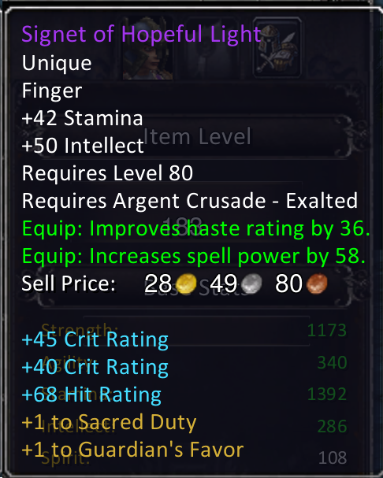
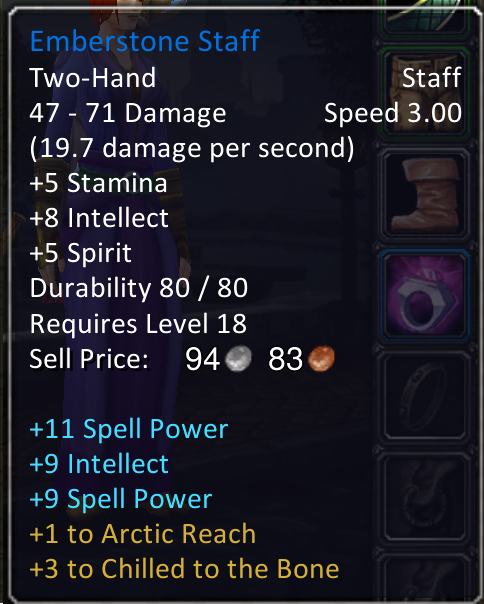
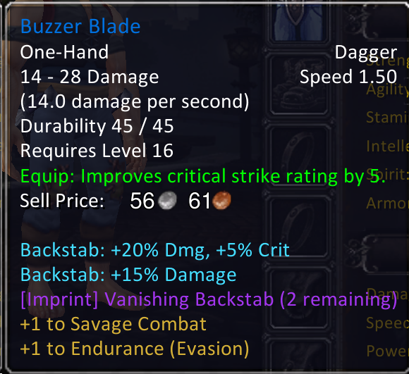
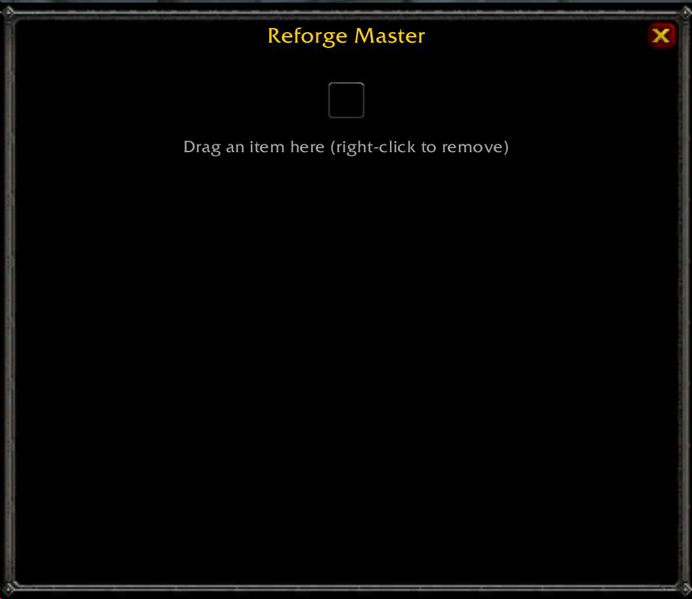
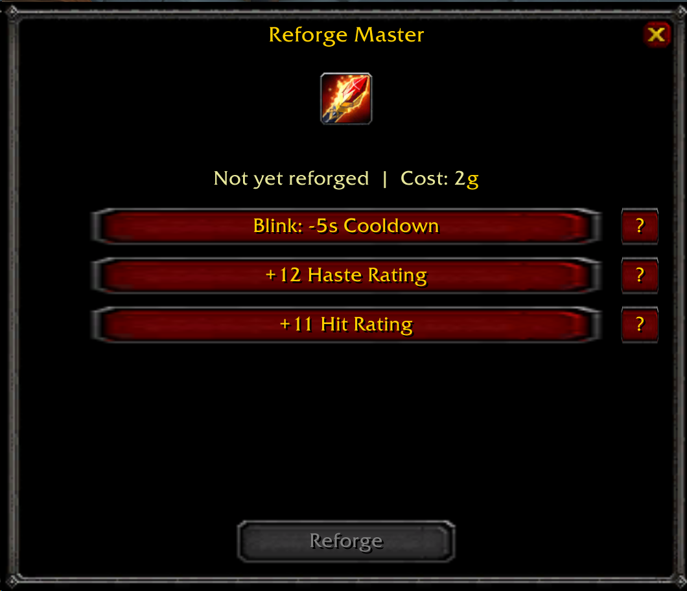
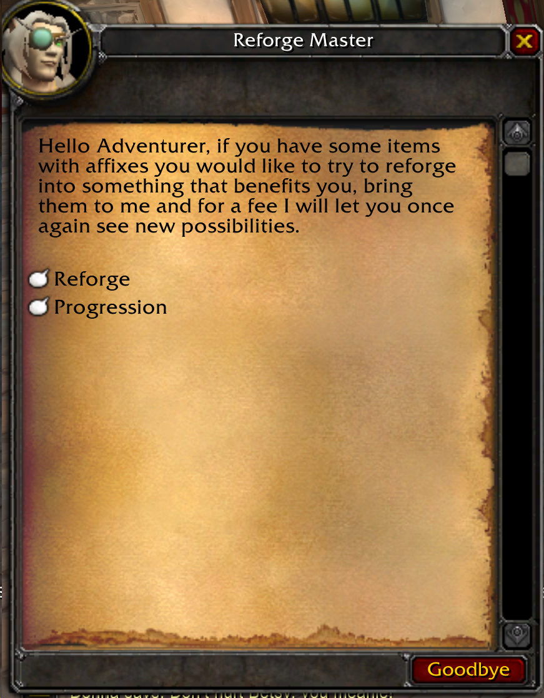
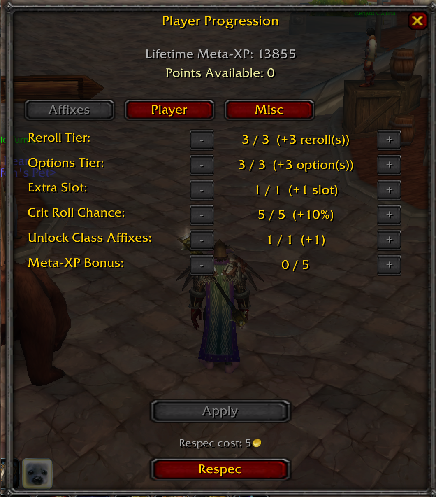
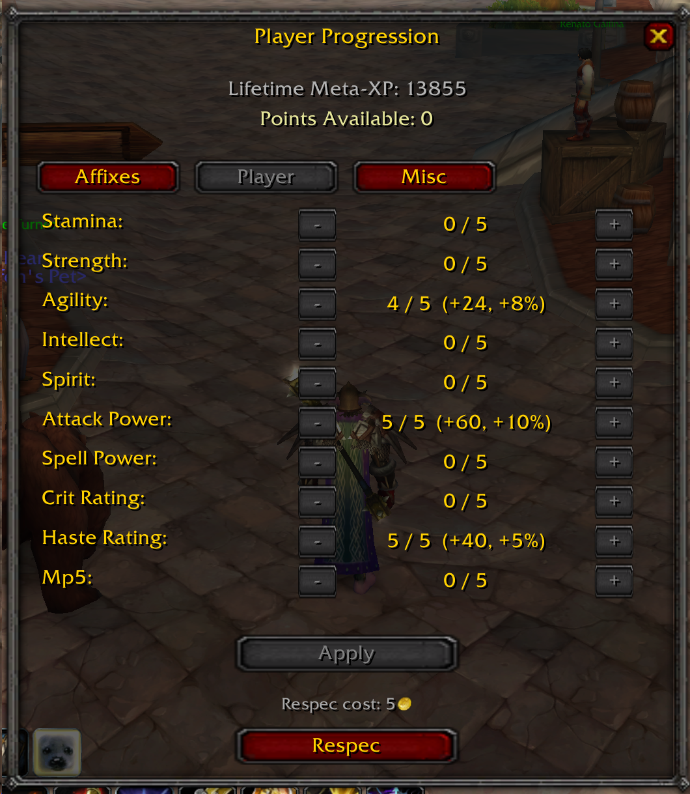
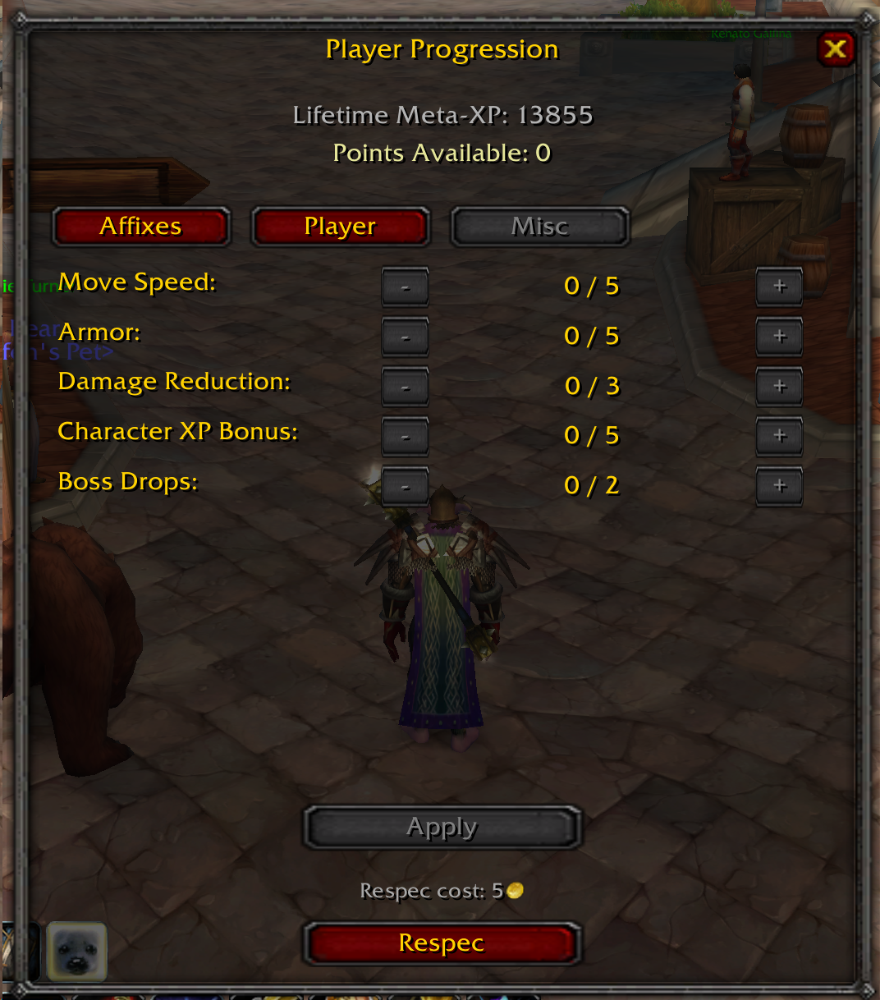

# mod-item-affixes

ARPG-style random affix system for AzerothCore (WoTLK 3.3.5a). Items receive affix slots when
they enter a player's inventory, gaining stat bonuses and class-specific spell modifiers that
persist through bank, mail, and trade. Two loot modes are supported side by side: **D3-style**
(items arrive fully rolled the instant you pick them up — the default) and **Manual** (Alt+Click
to pick from rolled options yourself, the original mode). A **Reforge NPC** lets you pay gold to
reroll one specific line on an already-rolled item later, and an account-wide **Player
Progression** system grants permanent bonuses over time.

---

## What it looks like

Every item — from a level 16 dagger to a level 80 epic ring — gets its own set of affixes.

| Level 80 Ret Paladin — ring | Level 18 Mage — staff | Level 16 Rogue — dagger |
|---|---|---|
|  |  |  |
| Stat affixes (+Crit, +Hit) and two talent bonuses to Sacred Duty and Guardian's Favor. | Spell Power stacking and talent ranks in Arctic Reach and Chilled to the Bone — at level 18. | Class skill modifiers on Backstab, plus an Imprint (Vanishing Backstab) showing 2 Return Allowances. |

Affixes scale with item level, so they feel meaningful at every stage of the game without
overshadowing base item stats. This is true regardless of which loot mode acquired the item.

---

## How It Works

Both modes populate the exact same `item_affix` rows and produce identical-looking tooltips —
they only differ in *how* a slot gets filled. Everything downstream (Reforge, Progression,
inspect/trade/AH visibility) works identically no matter which mode rolled the item.

<details open>
<summary><b>D3 Mode (default) — items arrive fully rolled, no picker</b></summary>

The moment an item enters your bags — looted, quest-rewarded, bought, mailed, crafted, anything —
it's immediately rolled and applied. There's no menu, no choice, nothing to click. You loot it,
you look at the tooltip, it's done.

- **Slots split into prefix and suffix buckets**, same terminology as Diablo: prefixes are class
  skill / SpellMod affixes, suffixes are stat affixes. They fill in order so prefixes always
  display above suffixes. The split size comes from the item's normal slot-count total (quality +
  two-hander bonus + Progression slot bonus) — there's no separate slot-count setting for this mode.
- **Talent affixes and Imprints roll independently on top**, governed by their own chance
  settings, exactly like Manual mode. An Imprint never costs the item a slot in D3 mode — the
  slot that happened to roll the Imprint chance still gets its own normal affix right after, so
  an Imprint is pure upside, never a tradeoff.
- **Crit rolls apply per slot** exactly like Manual mode — a lucky roll inflates the value and
  the tooltip line renders gold instead of blue.
- **Quest rewards can be excluded** (`D3ExcludeQuestRewards`, on by default) so turning in a
  quest still feels like picking your own reward — those items drop UNROLLED and go through the
  Manual picker instead, even on a D3-mode server.

Switch modes with `ItemAffixes.LootMode` (`1` = D3, `0` = Manual) — see
[Server Configuration](#server-configuration).

</details>

<details>
<summary><b>Manual Mode — Alt+Click to roll, choose, and reroll</b></summary>

1. **Acquisition** — when an item enters a player's bags, the module assigns 1–3 unrolled affix
   slots based on item quality and records them in `item_affix` (characters DB). Nothing is
   rolled yet; the item has no class fingerprint at this point and can be freely traded.

2. **Roll Menu** — Alt+Click an item with unrolled slots to open a preference page. Steer the
   roll before committing:
   - **What to roll?** — Any / Stats / Class Skills
   - **Talent Tree:** — which spec's passive talent bonus can roll (Any or a specific spec); also
     doubles the chance of rolling class affixes for that tree
   - **Stat family?** — Any / Tank / Physical / Caster / Healer / Ranged *(hidden when Class Skills selected)*
   - **Main stat?** — Any / Strength / Agility / Intellect / Spirit *(hidden when Class Skills selected)*

3. **Rolling** — clicking "Roll Affix" sends preferences to the server. The server presents 1–4
   affix options depending on item quality (configurable). Pick one to apply; the rest are discarded.

4. **Reroll System** — blue and epic items receive a number of rerolls (configurable per
   quality). In the option picker:
   - **Lock** any option with the `[ ]` button beside it — locked options are preserved across rerolls
   - **Reroll** all unlocked options while keeping locked ones using the "Reroll (N)" button
   - Freely change roll preferences between rerolls — only locked options carry over
   - Pick any visible option at any time to finalize that slot

5. **Talent affix** — each slot roll also attempts a passive talent bonus (10% green, 20-30%
   blue/purple, 100% legendary — configurable). Applied when the option is picked, not at roll
   time. Talent affixes stack per slot.

6. **Equip / Unequip / Login** — `SpellModifier` objects and stat bonuses apply on equip, are
   freed on unequip, and reapply automatically on login for everything currently worn.

### Affix Slots by Quality

| Quality       | Regular affix slots | Options per roll | Rerolls | Talent chance per slot |
|---------------|---------------------|------------------|---------|------------------------|
| Grey (poor)   | 0 — skipped         | —                | —       | —                      |
| White / Green | 1                   | 1 (configurable) | 0       | 10%                    |
| Blue (rare)   | 2                   | 2-3 (configurable) | 3     | 20%                    |
| Purple (epic) | 3                   | 3-4 (configurable) | 5     | 30%                    |
| Orange (Legendary) | 4              | 4 (configurable) | 7        | 100%                   |

Two-handed weapons receive 1 additional slot above the quality baseline (configurable via
`TwoHanderBonusSlots`). Green items can only roll universal stat affixes (Stamina, Crit, Haste,
Hit, etc.) — role-specific stats (Spell Power, Attack Power, Expertise, Dodge/Defense/Parry)
require blue quality or higher.

</details>

---

## Reforge NPC

Talk to the **Reforge Master**, or type **`/reforge`** from anywhere — no NPC visit required —
to open the same window. Pick one already-applied prefix/suffix line on an item and pay gold to
reroll just that line. The current value is always offered back as one of the choices, so you can
never be forced into a downgrade. Works on items from either loot mode.

<details open>
<summary><b>How reforging works</b></summary>

1. **Drag an item into the socket.** The window lists every currently-applied prefix/suffix line
   on it.

   

2. **Click a line to select it, then click Reforge to pay and roll.** The cost scales with item
   quality and how many times this item has already been reforged
   (`cost = baseCost × (1 + timesAlreadyReforged × 0.5)`, never resets). Click the **`?`** next to
   any line first if you want to preview every possible value that line's bucket (prefix or
   suffix) could roll into — completely free, no commitment, available before you've ever
   reforged the item at all.

   

3. **Pick one of the results.** The item's current value is always included and always listed
   first, so closing the window without picking simply leaves the item exactly as it was — you
   already paid for the privilege of looking, but you're never forced to take a worse roll.

4. **The item locks to that one line, permanently.** Every future reforge of this item can only
   ever target that same slot — the other lines stop being offered at all. Reforging also grants
   the same per-quality Player Progression meta-XP as a normal roll.

The Reforge Master also offers a **Progression** option in his gossip menu, opening the same
window as `/prog` — so both the Reforge window and the Progression tree are reachable from the
one NPC, or from anywhere via slash command.



**Video walkthrough:**

<video src="screenshots/video/Reforge%20example.mp4" controls width="640"></video>

*(If the video doesn't play inline, open
[screenshots/video/Reforge example.mp4](<screenshots/video/Reforge example.mp4>) directly.)*

Talent affixes and Imprints are intentionally out of scope for reforging — Imprints especially,
since letting them be rerolled would make them far too easy to obtain relative to how rare
they're meant to be.

</details>

---

## Player Progression

An optional, account-wide XP and talent-point system that layers permanent, passive bonuses on
top of the core affix system. Open it with **`/prog`**, or via the Reforge Master's
"Progression" gossip option.

<details>
<summary><b>How meta-XP is earned, and what it buys</b></summary>

Meta-XP is earned exclusively through **using the affix system** — rolling an item (Manual pick
or D3 auto-roll) or paying for a Reforge reroll all grant the same per-quality XP amount. There's
no passive trickle from ordinary character leveling by default (`ProgressionTricklePct = 0`) —
the intent is that this system levels up as you get and roll more items, not just from playing
the game in general. An optional passive trickle skim from character XP gains can still be
enabled if you want one on top.

Points are spent per-character across three tabs:



**Affixes tab** — bonuses to the roll process itself: reroll tier, options tier, an extra affix
slot, crit roll chance, a meta-XP % multiplier, and (optionally) a gate that requires investment
before class/spellmod affixes can roll at all.



**Player tab** — flat + % hybrid bonuses to primary stats, Attack Power, Spell Power, Crit/Haste
Rating, and MP5. The flat half feels strong at low level; the % half keeps scaling with gear at cap.



**Misc tab** — Move Speed, Armor, Damage Reduction, a character XP % multiplier, and Boss
Drops (extra item rolls from a boss's own loot table, summed across every eligible group
member's own investment).

Respec is gold-gated (flat fee, scales with character level) and only refunds points that
haven't been permanently committed this session.

</details>

---

## Imprint System

Imprints are rare, class-specific enchantments that sit alongside an item's regular affixes. Only
one Imprint can ever be on an item at a time. Imprints are more powerful than stat affixes and
may trigger custom server-side effects (see `src/Imprints/` for implementations).

<details>
<summary><b>Acquiring, applying, and disenchanting Imprints</b></summary>

### Acquiring an Imprint

- **Manual mode roll** — when an Imprint option appears during a roll (chance configured by
  `ItemAffixes.ImprintRollChance`), selecting it applies the Imprint and **refunds** the affix
  slot — Imprints never consume a regular affix slot in Manual mode either; the slot just goes
  back to UNROLLED and can be filled with a normal affix on the next roll.
- **D3 mode auto-roll** — the same chance is rolled independently per prefix slot; if it hits,
  the Imprint is applied *and* that slot still gets its own normal affix in the same pass — pure
  upside, see [How It Works](#how-it-works) above.
- **GM command** — `.imprint grant <name>` grants a Rune directly to the player's bags for
  testing. `.imprint apply` applies the Rune from the player's bags to a targeted item.
- **Never via the Reforge NPC** — intentionally out of scope; see the [Reforge NPC](#reforge-npc)
  section.

### Rune apply mechanic (in-game)

1. **Right-click the Rune** in your bags — the cursor displays the Rune icon and a message
   prompts you to left-click the target item.
2. **Left-click the target item** — the Imprint is applied. If the item already has an Imprint,
   an error is shown instead.
3. **Right-click anywhere** (or click empty bag space) — cancels apply mode.

The Rune apply mode shows a full-screen click interceptor so the target item is never
accidentally picked up or equipped during the interaction.

### Return Allowances

Each Rune tracks how many times it can be re-applied after disenchanting an imprinted item
(**Return Allowances**). The count is shown in the tooltip as `(N remaining)` in purple, or
`(0 remaining — no rune on disenchant)` in red when the count is zero. Disenchanting an item
with an Imprint whose allowance is 0 does **not** grant a Rune. The starting allowance count for
newly granted Runes is configurable via `ImprintExtractionCount`.

### Disenchanting

Disenchanting an imprinted item grants a Rune into the player's bags (if allowances remain) and
removes the Imprint from the item. The returned Rune's allowance count is decremented by one.


</details>

---

## Stat Value System

<details>
<summary><b>Budget formula and worked example</b></summary>

Generic stat affix values (Strength, Stamina, Spell Power, etc.) are computed at roll-time from
the item's WotLK stat budget — no hardcoded value tables, and this applies identically in both
loot modes.

```
baseBudget  = f(ItemLevel)          # piecewise linear by era (see below)
slotBudget  = baseBudget × slotMod  # 100% / 74% / 54% by slot type
affixBudget = slotBudget × qualityFraction × StatMultiplier
statValue   = irand( floor(affixBudget × BudgetMinRoll / cost),
                     floor(affixBudget / cost) )
```

**Era breakpoints** (using item gear score, not required level):

| Era       | iLvl range | Formula                   | Example iLvl 200 |
|-----------|-----------|---------------------------|-----------------|
| Vanilla   | 1 – 66    | `iLvl × 0.78 + 1.5`      | —               |
| TBC       | 67 – 114  | `iLvl × 1.25 − 28.5`     | —               |
| WotLK     | 115 – 284 | `iLvl × 1.92 − 105`      | 279 pts         |

**Slot multipliers:**

| Multiplier | Slots                                   |
|------------|-----------------------------------------|
| 100%       | Head, Chest, Legs, 2H Weapons, Ranged   |
| 74%        | Shoulders, Hands, Waist, Feet           |
| 54%        | Neck, Cloak, Wrists, Rings, Trinkets, 1H Weapons, Off-hands, Wands |

**Stat exchange rates** (WotLK itemization):

| Stat            | Cost per point | Effect                          |
|-----------------|---------------|---------------------------------|
| Attack Power    | 0.5           | You get 2× the budget in AP     |
| Spell Power     | 0.86          | Slightly more SP than primaries |
| Everything else | 1.0           | 1 budget point = 1 stat point   |

**Example** — iLvl 251 2H weapon, Epic (purple), `StatMultiplier = 1.0`:
- Base budget: `251 × 1.92 − 105 = 377.9`
- Slot (2H = 100%): `377.9`
- Quality fraction (purple = 10%): `37.8`
- Strength roll: `irand(28, 37)` — varies each roll within a fixed window
- Attack Power roll: `irand(56, 75)`
- Spell Power roll: `irand(32, 43)`

A crit roll (see `EnableCritRolls`/`CritRollChance`) multiplies the final rolled value by 1.5
(ceiling) and renders the tooltip line gold instead of blue.

</details>

---

## Prerequisites

- AzerothCore WoTLK 3.3.5a (standard build)
- CMake, MSVC (or GCC/Clang), MySQL 8.x
- PowerShell 5.1+ (Windows) or PowerShell Core `pwsh` (Linux/macOS, optional — only needed to regenerate SQL from JSON)
- GM account with `SEC_GAMEMASTER` access (for testing)

---

## Installation

> **Important:** Confirm your vanilla AzerothCore server works and you can create characters before starting. Do not clone this module until the vanilla server is verified — if the module is present during the initial build it will try to create tables that don't exist yet and prevent the worldserver from starting.

<details open>
<summary><b>Step 1 — Place the module and apply core patches</b></summary>

Clone the module into your AzerothCore `modules/` directory:

```
git clone https://github.com/Nevaden/mod-item-affixes modules/mod-item-affixes
```

Then apply the required engine patches (idempotent — safe to run more than once):

```
# Windows — double-click or run from the module folder:
scripts\install\0-apply-core-patches.bat

# Windows (command line / CI):
powershell -ExecutionPolicy Bypass -File scripts\apply_core_patches.ps1

# Linux / macOS:
pwsh -File scripts/apply_core_patches.ps1
```

If the script reports `[FAIL]` on any patch, see `CORE_PATCHES.md` for the exact change to apply by hand.

</details>

<details open>
<summary><b>Step 2 — Configure</b></summary>

**Windows:** Copy `scripts\config.bat.example` to `scripts\config.bat` and fill in your values.

**Linux / macOS:** Copy `scripts/config.sh.example` to `scripts/config.sh` and fill in your values.

`config.bat` / `config.sh` are gitignored — your credentials are never committed.

Run the config check to verify everything before proceeding:

```
# Windows
scripts\check-config.bat

# Linux / macOS
bash scripts/check-config.sh
```

</details>

<details open>
<summary><b>Step 3 — Build the worldserver with the module</b></summary>

Stop the worldserver, then rebuild and reinstall from your AzerothCore build directory:

```
cmake --build "path\to\build" --config RelWithDebInfo --target worldserver
cmake --install "path\to\build" --config RelWithDebInfo
```

</details>

<details open>
<summary><b>Step 4 — Run the install scripts</b></summary>

Each script does one focused thing. Run them in order:

| Script | What it does |
|--------|-------------|
| `scripts\install\1-create-schema.bat` / `.sh` | Creates mod tables in the characters DB; copies `.conf.dist` to `.conf` |
| `scripts\install\2-load-data.bat` / `.sh` | Generates SQL from JSON and applies all affix/imprint/spell data to the world DB |
| `scripts\install\3-patch-client.bat` *(Windows only)* | Patches `SpellItemEnchantment.dbc` and `Spell.dbc`; rebuilds client MPQ files |

> On first run the patch scripts auto-detect two free MPQ suffix letters (scanning `patch-Z.MPQ` downward) and record them in `scripts\local_config.bat` for reuse. To pin specific letters, set `PATCH_SUFFIX_DBC` and `PATCH_SUFFIX_SPELLS` in `config.bat`.

If the WoW client is on a separate machine, copy both new MPQ files from your Data folder to that machine after step 3.

</details>

<details open>
<summary><b>Step 5 — Install the client addon</b></summary>

Copy `addon\ItemAffixes\` to your WoW client's AddOns folder:

```
WoW Client 3.3.5a\Interface\AddOns\ItemAffixes\
```

**Optional companion addon — ItemAffixesToast** (by [Rykaerdoe](https://github.com/Rykaerdoe)):
toasts and plays a sound the instant a roll produces a Critical or Imprint option (Manual mode,
D3-mode drops, and Reforge rerolls alike — independent of whether it's picked), and posts a chat
alert when equipping an item that still has affix rolls to do. Fully self-contained — hooks
`ItemAffixes` from the outside via `hooksecurefunc`, no changes needed to `ItemAffixes` itself.
Copy `addon\ItemAffixesToast\` alongside `ItemAffixes\` the same way, or skip it — the base addon
works identically either way. The sound is set by `AFX_TOAST_SOUND_ID` near the top of
`ItemAffixesToast.lua` — change the ID there for a different sound. Toggle it independently in
the in-game AddOns list.

</details>

<details open>
<summary><b>Step 6 — Start worldserver</b></summary>

Start the worldserver. Look for these lines in the console to confirm the module loaded:

```
mod-item-affixes: loaded NNN affix template(s).
mod-item-affixes: loaded NNN talent affix def(s).
mod-item-affixes: Loaded N Imprint definition(s).
```

</details>

---

## Keeping Up to Date

<details>
<summary>After <code>git pull</code>, run the appropriate update script</summary>

Schema tables are never touched.

| Need | Script |
|------|--------|
| Update everything (affixes + imprints + client patch) | `scripts\update\update-all.bat` / `.sh` |
| Affix / talent data only | `scripts\update\affixes.bat` / `.sh` |
| Imprint definitions only | `scripts\update\imprints.bat` / `.sh` |
| Client MPQ files only | `scripts\update\client-patch.bat` *(Windows only)* |

If the pull also includes C++ changes, rebuild and reinstall the worldserver first, then run the update script.

If the pull adds new core patches, re-run `scripts\apply_core_patches.ps1` — already-applied patches are skipped automatically.

</details>

---

## Uninstalling

<details>
<summary>Run the uninstall scripts in order</summary>

Each one is a separate, confirmable step.

| Script | What it does |
|--------|-------------|
| `scripts\uninstall\1-drop-tables.bat` / `.sh` | Drops `item_affix`, `item_talent_affix`, `item_imprint`, `item_reforge_state`, and Player Progression tables from characters/auth DB (confirmation required) |
| `scripts\uninstall\2-clean-world-data.bat` / `.sh` | Drops world tables; removes rune/spell rows from shared tables; removes server conf file; **shows which MPQ files to delete manually** |
| `scripts\uninstall\3-rebuild-server.bat` / `.sh` | Reconfigures cmake to exclude module and rebuilds worldserver |

After the scripts finish, complete these steps manually:

1. **Delete the MPQ files** shown by step 2. The script reads the suffix letters from `scripts\local_config.bat` (recorded at install time) and shows the exact file paths. Only delete files you know belong to this mod.
2. Remove the addon(s): `Interface\AddOns\ItemAffixes\` and `Interface\AddOns\ItemAffixesToast\` if installed
3. Restart the WoW client
4. Restart the worldserver

> **All player affix, Reforge, and Progression data is permanently lost** when step 1 runs — it cannot be recovered.

</details>

---

## Disable / Enable (without data loss)

<details>
<summary>Temporarily turn the module off without deleting player data</summary>

| Script | What it does |
|--------|-------------|
| `scripts\manage\disable.bat` / `.sh` | Excludes module from cmake build and rebuilds (data preserved) |
| `scripts\manage\enable.bat` / `.sh` | Re-includes module in cmake build and rebuilds |

Both scripts require `CMAKE` and `BUILD_DIR` to be set in `config.bat` / `config.sh`.

Items affixed before disabling keep their `item_affix` rows; no mods are applied while the module is disabled. Re-enabling fully restores all functionality.

</details>

---

## Multiplayer Affix Visibility

<details>
<summary>Inspect, trade, and Auction House tooltips</summary>

### Inspecting other players

When you open another player's inspect window and hover over their equipped items, the addon
shows their affix lines in the tooltip — applied affixes in blue (gold if crit), talent bonuses
in gold, imprints in purple. Items not yet rolled show a grey `[Affix slot not yet rolled]`
placeholder.

Shift+hovering an inspected item shows a comparison tooltip of your own equipped item in the
same slot, with your affixes included.

### Trade window

Hovering items in the trade window — both your items and the partner's — shows their affix
state. Shift+hover shows a comparison tooltip against your currently equipped item.

### Auction house

Hovering any item in the Auction House shows its affix state:

- **Applied affixes** — blue (gold if crit), identical to the item owner's tooltip view.
- **Talent bonuses** — gold.
- **Imprints** — purple, with Return Allowance count.
- **Unrolled slots** — `[Affix slot not yet rolled]` in grey.

AH lookups are read-only. Shift+hover shows a comparison tooltip against your equipped item.

Items that have no affixes cached yet show `[Fetching affixes...]` briefly while the server
responds; this resolves automatically without needing to re-hover.

When multiple copies of the same item are listed at the same price by the same seller, each
listing correctly shows its own unique affixes. The addon assigns a per-listing offset so the
server returns the correct physical item instance for each slot.

</details>

---

## Screenshots — Manual Mode Roll Menu walkthrough

<details>
<summary>Step-by-step images of the Alt+Click roll/reroll flow</summary>

### Alt+Click to open the Roll Menu


The Roll Menu appears when a player Alt+Clicks any item with unrolled affix slots.

### Roll preferences


Players steer the roll before committing — stat family, spec tree, main stat, and type (stats vs. class skills). The spec selector also boosts the chance of rolling class affixes for that tree.

### Class skills roll


When "Class Skills" is selected, the server presents spell modifier options for the player's class and the talent tree chosen in the Roll Menu. A class skill only appears as an option if the character has already learned that ability — you will never roll a modifier for a spell you don't know.

### Reroll System — initial roll with lock buttons


Each option has a lock toggle (`[ ]`) beside it. The "Reroll (N)" button shows how many rerolls remain. Pick any option at any time, or lock the ones you want to keep and reroll the rest.

### Reroll System — lock one, reroll for more class skills


Shield of Righteousness is locked (`[L]`). The other options were rerolled targeting Protection class skills. The reroll preferences (type, spec, stat family) can be changed freely between rerolls — only locked options are preserved.

### Reroll System — lock two, switch to tank stats


Two class skill options are now locked. Type was switched to "Stats" and Stat Family to "Tank" before the next reroll — giving tank stat options for the remaining unlocked slot. A stat option can be chosen here or another reroll attempted.

### Critical roll toast (ItemAffixesToast)


With the optional [ItemAffixesToast](#installation) addon installed (see Step 5), a Critical or Imprint roll pops this toast and plays a sound the instant it's generated — in Manual mode, D3-mode drops, and Reforge rerolls alike — before you've even picked an option, so it's never missed.

</details>

---

## Verifying It Works

<details>
<summary>Quick smoke test for both loot modes, Reforge, and Imprints</summary>

**Manual mode (`LootMode = 0`):**
1. Log in as a GM character.
2. Loot or purchase any green-quality or better item.
3. Alt+Click the item — the Roll Menu frame should appear.
4. Select preferences (or leave at defaults) and click "Roll Affix."
5. Choose one of the presented options, or lock options and use "Reroll (N)" to reroll.
6. Equip the item — the tooltip shows the applied affix and any talent bonus.
7. If the affix is a spellmod, cast the affected spell and confirm the modifier applies.

**D3 mode (`LootMode = 1`, the default):**
1. Loot or purchase any green-quality or better item.
2. The item's tooltip should already show fully-applied affix lines — no Roll Menu appears at all.

**Reforge:**
1. `.npc add 601107` to spawn a Reforge Master (or use `/reforge` if you already have one placed).
2. Drag an item with at least one applied line into the socket.
3. Click a line, click Reforge, pick one of the results.
4. Confirm the item's tooltip actually changed, and that a second reforge attempt only offers
   that same line.

**Imprints:**
1. `.imprint grant <name>` — grants a Rune to your bags.
2. Right-click the Rune — cursor indicator appears and apply mode activates.
3. Left-click a target item — Imprint is applied; Rune is consumed.
4. Disenchant the imprinted item — a Rune is returned (if allowances remain).

</details>

---

## Server Configuration

<details>
<summary>Key settings by category (see <code>conf/mod_item_affixes.conf.dist</code> for the full, fully-commented list)</summary>

`conf/mod_item_affixes.conf.dist` is organized into numbered sections, ordered by how often a
server admin actually needs to touch them — copied to your live conf by `install/1-create-schema`.

```ini
# 1. Loot Mode — the single biggest switch in the file
ItemAffixes.LootMode = 1   # 0=Manual (Alt+Click picker), 1=D3-style (default, auto-rolled)

# 2. Slots & Options
ItemAffixes.TwoHanderBonusSlots = 1
ItemAffixes.SlotCountGreen/Blue/Purple/Legendary = 1 / 2 / 3 / 4
ItemAffixes.OptionsCountGreen/Blue/Purple/Legendary = 1 / 2 / 3 / 4   # Manual mode only
ItemAffixes.RerollsGreen/Blue/Purple/Legendary = 0 / 3 / 5 / 7        # Manual mode only

# 3. Class & Talent Affixes
ItemAffixes.EnableClassSkillAffixes = 1
ItemAffixes.ClassAffixChance = 20
ItemAffixes.ClassAffixMaxPerItem = 1
ItemAffixes.EnableTalentAffixes = 1
ItemAffixes.TalentAffixChanceGreen/Blue/Purple/Legendary = 10 / 20 / 30 / 100

# 4. Crit Rolls
ItemAffixes.EnableCritRolls = 1
ItemAffixes.CritRollChance = 10   # % chance per roll/option; applies to D3 and Reforge too

# 5. Imprints
ItemAffixes.ImprintRollChance = 5
ItemAffixes.ImprintExtractionCount = 2

# 6. Stat Power Tuning
ItemAffixes.BudgetFractionGreen/Blue/Purple/Legendary = 0.18 / 0.13 / 0.10 / 0.09
ItemAffixes.BudgetMinRoll = 0.75
ItemAffixes.StatMultiplier = 1.0   # 1.0=WotLK-accurate, 1.5+=power fantasy

# 7. Reforge NPC — cost escalates per reforge already done to an item
ItemAffixes.ReforgeBaseCostGreen/Blue/Purple/Legendary = 5000 / 20000 / 75000 / 250000

# 8. Addon UI Selectors — Manual mode only, off by default (custom-class servers only)
ItemAffixes.EnableClassSkillAffixSelection / EnableTalentAffixSelection /
            EnableRoleSelection / EnableMainStatSelection = 0 / 0 / 0 / 1

# 9. Player Progression — optional subsystem, see its own section above
ItemAffixes.ProgressionEnabled = 1
ItemAffixes.ProgressionTricklePct = 0   # meta-XP from passive char leveling; 0=off by default
ItemAffixes.ProgressionXpGreen/Blue/Purple/Legendary = 10 / 30 / 60 / 200  # per roll or reforge
# ...plus per-node MaxRank/ValuePerRank settings across the Affixes/Player/Misc tabs
```

</details>

---

## Adding New Affixes

<details>
<summary>Stat, SpellMod, Talent affixes, and Imprints</summary>

### Stat affixes (generic)

Edit `affixes/generics_defs.json`. Each entry defines metadata — which stat, which slots, which
role family, minimum quality required. **No value ranges are needed** — values are computed at
runtime from the WotLK item budget formula.

Key fields:
- `stat.op` — maps to `GenericStatOp` enum (0=Stamina, 1=Strength, 2=Agility … see `ItemAffix.h`)
- `role` — `"PHYSICAL"`, `"CASTER"`, `"HEALER"`, `"TANK"`, `"RANGED"`, `"CASTER_HEALER"`, `"PHYSICAL_RANGED"`, or omit for universal
- `item_category` — `0`=any, `1`=1H weapon, `2`=2H weapon, `4`=armor, `5`=jewelry, `6`=wand, `7`=boots, `8`=dagger
- `min_quality` — `1`=green+, `2`=blue+, `3`=epic+
- `loot_bucket` — optional D3-mode-only override (`"prefix"` or `"suffix"`); omit for the default
  by-affix-type classification

After editing, run `scripts\update\affixes.bat` (or `.sh`) to regenerate and apply SQL.

### SpellMod affixes (class-specific)

Edit the appropriate `class_affixes/[class].json`. Key fields: `spell_family`, `family_flags[3]`,
`carrier_spell`, `spellmod_op`, `spellmod_type`, `spellmod_value`.

Use `SPELLS_REFERENCE.csv` to look up spell IDs and family flags.

### Talent affixes

Edit the appropriate `talent_affixes/<Class>/<spec>.json` (spec-specific, `spec_tree=0/1/2`).
Only add talents with `max_rank >= 2` (single-rank talents are excluded by design).

### Imprints

See `docs/ADDING_NEW_IMPRINT.md` for a full walkthrough. The short version:

1. Add a row to `data/sql/db-world/imprints/imprint_def.sql` (id, name, runeItemId, extractionsMax, classMask, specTree).
2. Add an enum entry to `ImprintId` in `src/Imprints/ImprintMgr.h`.
3. Create `src/Imprints/<Class>/<ImprintName>.cpp` implementing `ImprintEffect`.
4. Register the handler in `src/mod_item_affixes_loader.cpp`.
5. Rebuild and run the updated SQL.

After any JSON edits: **run `scripts\update\affixes.bat`** (or `.sh`) from the module folder.

</details>

---

## Directory Structure

<details>
<summary>Full module layout</summary>

```
mod-item-affixes/
├── README.md
├── CORE_PATCHES.md                  ← what each core patch changes (applied by apply_core_patches.ps1)
├── CMakeLists.txt
│
├── scripts/
│   ├── config.bat.example           ← COPY TO config.bat and fill in (Windows)
│   ├── config.sh.example            ← COPY TO config.sh and fill in (Linux/macOS)
│   ├── config.bat                   ← gitignored — your credentials, paths, and ID ranges
│   ├── config.sh                    ← gitignored — Linux/macOS equivalent
│   ├── local_config.bat             ← gitignored — auto-generated; records MPQ suffix letters
│   ├── check-config.bat / .sh       ← pre-flight check: verifies all config settings
│   ├── apply_core_patches.ps1       ← patches the AzerothCore engine source (run once)
│   ├── build_affixes.ps1            ← generates affix_template.sql from affixes/*.json + class_affixes/*.json
│   ├── build_talent_affixes.ps1     ← generates talent_affix_def.sql from talent_affixes/
│   ├── patch_dbc.ps1                ← patches SpellItemEnchantment.dbc and rebuilds MPQ
│   │
│   ├── install/                     ← run in order: 0 (pre-build), then 1, 2, 3
│   │   ├── 0-apply-core-patches.bat   ← applies engine patches; run BEFORE cmake/build
│   │   ├── 1-create-schema.bat / .sh  ← creates DB tables; copies .conf.dist to .conf
│   │   ├── 2-load-data.bat / .sh      ← loads all affix/imprint/spell SQL
│   │   └── 3-patch-client.bat         ← patches DBC + rebuilds MPQ (Windows only)
│   │
│   ├── uninstall/                   ← run in order: 1, 2, 3
│   ├── update/                      ← run after git pull or content edits
│   └── manage/                      ← enable/disable without data loss
│
├── affixes/
│   └── generics_defs.json   ← stat affix definitions (metadata only — no value ranges)
│
├── class_affixes/
│   └── [class].json         ← spellmod affixes per class (mage.json, rogue.json, etc.)
│
├── talent_affixes/
│   ├── _maps.json           ← lookup maps for build script (enum → integer)
│   └── <Class>/
│       └── <spec>.json      ← per-spec talent entries (spec_tree=0/1/2)
│
├── imprints/
│   └── custom_spells.json   ← spell definitions used by Imprint effects
│
├── src/
│   ├── ItemAffix.h / .cpp            ← core engine: rolling, applying, Reforge, addon protocol
│   ├── ItemAffixScripts.cpp          ← AzerothCore hook registrations (equip/login/quest/XP/etc.)
│   ├── ItemAffixCommands.cpp         ← GM commands (.affix reroll, .affix reforge, etc.)
│   ├── ReforgeMasterNPC.cpp          ← Reforge Master gossip (Reforge + Progression options)
│   ├── PlayerProgression.h / .cpp    ← account-wide meta-XP + talent tree engine
│   ├── PlayerProgressionNodes.h      ← node id / MaxRank / ValuePerRank definitions
│   ├── PlayerProgressionBossDrops.cpp
│   ├── PlayerProgressionLifesteal.cpp
│   ├── mod_item_affixes_loader.cpp
│   └── Imprints/
│       ├── ImprintMgr.h / .cpp
│       ├── ImprintCommands.cpp
│       └── <Class>/
│           └── <ImprintName>.cpp
│
├── addon/
│   ├── ItemAffixes/
│   │   ├── ItemAffixes.lua       ← main addon logic, tooltip hooks, slash commands
│   │   ├── ItemAffixRollUI.xml / .lua  ← Manual-mode roll menu + option picker + reroll UI
│   │   ├── ReforgeUI.xml / .lua        ← Reforge window + "?" preview panel
│   │   └── ProgressionUI.lua           ← Player Progression frame
│   └── ItemAffixesToast/
│       └── ItemAffixesToast.lua  ← optional companion addon (see Step 5 above)
│
├── conf/
│   └── mod_item_affixes.conf.dist
│
├── docs/
│   ├── ADDING_AFFIXES.md
│   ├── ADDING_NEW_IMPRINT.md
│   ├── ADDING_TALENT_AFFIXES.md
│   ├── REFORGE_PLAN.md
│   ├── D3_LOOT_MODE_PLAN.md
│   ├── PLAYER_PROGRESSION_PLAN.md
│   ├── ROADMAP.md
│   └── ...
│
└── data/sql/
    ├── db-characters/
    │   ├── item_affix.sql             ← run on acore_characters
    │   ├── item_talent_affix.sql      ← run on acore_characters
    │   ├── item_imprint.sql           ← run on acore_characters
    │   ├── item_gem_affix.sql         ← run on acore_characters
    │   ├── item_reforge_state.sql     ← run on acore_characters
    │   ├── character_meta_progression.sql
    │   └── character_progression_nodes.sql
    ├── db-auth/
    │   └── account_meta_progression.sql
    └── db-world/
        ├── reforge_master_npc.sql        ← creature_template/model/npc_text/gossip_menu for entry 601107
        ├── affix_template.sql            ← generated — do not edit directly
        ├── talent_affix_def.sql          ← generated — do not edit directly
        ├── affix_spec_tree_<class>.sql   ← one per class
        └── imprints/
            ├── imprint_def.sql
            ├── imprint_rune_item.sql
            └── ...creature/spell SQL per Imprint
```

</details>

---

## Database Tables

<details>
<summary>Schema reference</summary>

### `item_affix` (characters DB)
One row per affix slot per item.

| Column               | Type    | Description                                          |
|----------------------|---------|------------------------------------------------------|
| `item_guid`          | BIGINT  | Raw GUID of the item                                 |
| `affix_slot`         | TINYINT | Slot index (0-based; up to 6)                        |
| `roll_state`         | TINYINT | 0=UNROLLED, 1=PENDING (player choosing), 2=APPLIED   |
| `affix_id`           | INT     | ID from `affix_template`; 0 while UNROLLED/PENDING   |
| `rolled_value`       | INT     | Stat value rolled (stat affixes); 0/150/200/250 scale flag for spellmods |
| `is_crit`            | TINYINT | 1 if this slot's current value came from a crit roll — the only way to tell a crit STAT roll from a normal one, since STAT values (unlike SpellMod's 150/200/250 scale flags) have no reserved sentinel of their own |
| `pending_opts`       | VARCHAR | Serialised options while PENDING: `"id:val:crit,..."`|
| `rerolls_remaining`  | TINYINT | Rerolls left for this slot; 0 when spent             |
| `locked_mask`        | TINYINT | Bitmask: bit N set = option N is locked across rerolls|
| `pending_spec`       | TINYINT | Spec tree selected via addon at roll time; -1=dominant tree |

### `item_reforge_state` (characters DB)
One row per item that has ever been reforged. No row = never reforged, any applied line is eligible.

| Column          | Type    | Description                                              |
|-----------------|---------|-----------------------------------------------------------|
| `item_guid`     | BIGINT  | Raw GUID of the item (primary key)                        |
| `locked_slot`   | TINYINT | The one `affix_slot` this item is permanently locked to    |
| `reroll_count`  | INT     | Times reforged; drives escalating cost, never resets       |
| `pending_opts`  | VARCHAR | Candidates awaiting `REFORGE_PICK`; never trusts client-supplied values, only an index into this |

### `item_talent_affix` (characters DB)
One row per affix slot per item that successfully rolled a talent bonus.

| Column          | Type    | Description                                          |
|-----------------|---------|-------------------------------------------------------|
| `item_guid`     | BIGINT  | Raw GUID of the item                                 |
| `affix_slot`    | TINYINT | Which regular affix slot triggered this talent roll  |
| `affix_id`      | INT     | ID from `talent_affix_def`                           |
| `rolled_value`  | INT     | Bonus ranks rolled (1 .. maxRank)                    |

### `item_imprint` (characters DB)
One row per imprinted item or Rune.

| Column              | Type    | Description                                              |
|---------------------|---------|------------------------------------------------------------|
| `item_guid`         | BIGINT  | Raw GUID of the imprinted item or Rune                   |
| `imprint_id`        | INT     | ID from `imprint_def`                                    |
| `extractions_left`  | INT     | Return Allowances remaining (0 = no Rune on disenchant)  |

### `character_meta_progression` (characters DB) / `account_meta_progression` (auth DB)
Per-character node ranks and the account-wide lifetime meta-XP pool for Player Progression.

### `affix_template` (world DB) — generated, do not edit directly

| Column          | Description                                                              |
|-----------------|--------------------------------------------------------------------------|
| `id`            | Unique affix ID                                                          |
| `name`          | Internal name (logging / tooltip)                                        |
| `weight`        | Roll pool weight; 0 = disabled                                           |
| `min_quality`   | Minimum item quality: 1=green+, 2=blue+, 3=epic+                        |
| `affix_type`    | 0=SPELLMOD, 1=STAT                                                       |
| `stat_op`       | GenericStatOp enum value (STAT affixes only; 0 for SPELLMOD)             |
| `spell_family`  | SpellFamilyName (0=generic; 8=Rogue; 3=Mage; etc.)                      |
| `spec_tree`     | 255=any spec; 0/1/2=specific talent tree (spellmod affixes only)         |
| `role_mask`     | AffixRoleGroup bitmask: 0=any, 1=CASTER, 2=PHYSICAL, 4=TANK, 8=HEALER, 16=RANGED |
| `item_category` | 0=any item; 1=1H weapon; 2=2H weapon; 4=armor; 8=dagger-or-non-weapon   |
| `carrier_spell` | Rank-1 spell ID; used for `IsAffectedBySpellMod` resolution              |
| `enchant_id`    | `SpellItemEnchantment.dbc` ID for the green tooltip line (0=none)        |
| `loot_bucket`   | D3 mode only: 0=auto (by affix_type), 1=force prefix, 2=force suffix    |

See `docs/ADDING_AFFIXES.md` for a full authoring guide.

</details>

## Credits

The Player Progression Lifesteal node's damage-to-heal mechanism is ported
from [ZhengPeiRu21/mod-leech](https://github.com/ZhengPeiRu21/mod-leech)
(MIT License), the standalone AzerothCore module it replaces.

Thanks to [Rykaerdoe](https://github.com/Rykaerdoe) for the ItemAffixesToast
companion addon and for a round of Progression fixes and polish: a crash on
3.3.5a caused by the Retail-only `Frame:SetShown`, hiding config-disabled
(`MaxRank=0`) nodes instead of showing a dead `0/0` row, a points-gained
toast/chat notification, and stale paths in the update scripts.
